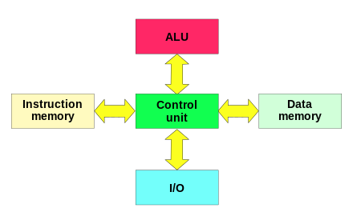
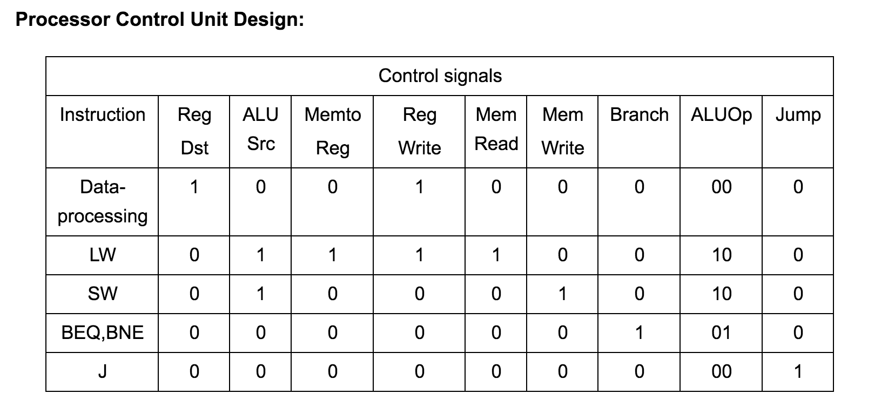
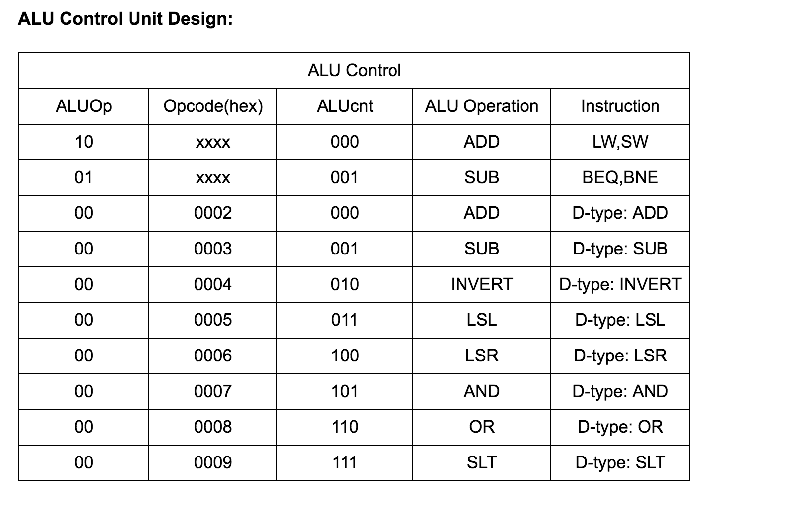

# 8 bit RISC Microprocessor

**Author: Varun Sundar, EE16B068.**

_Done as a part of semester project for EE2016_

Architecture based on Harvard RISC Architecture.

_________
### General Structure:

* 8 bit processor,
* 16 bit Program counter
* 16 bit IMEM output
* 8 bit regsiter, 8 numbers.
_________
### ALU Opcodes:

3'b000: {carry,result} = a + b; // add  
3'b001: {borrow,result} = a - b; // sub  
3'b010: result = ~a;        // Invert  
3'b011: result = a<<b;     //Left shift by b bits  
3'b100: result = a>>b;     //Right shift by b bits  
3'b101: result = a & b; // and  
3'b110: result = a | b; // or  
3'b111: begin if (a<b) result = 16'd1; //compare if a<b  
default: add  

------------

### The Instruction set of the RISC processor:

#### A. Memory Access Instructions
1. Load Word:  (OP 0000)
               LD ws, offset(rs1) ws:=Mem16[rs1 + offset]
2. Store Word: (OP 0001)
               ST rs2, offset(rs1) Mem16[rs1 + offset]=rs2

#### B. Data Processing Instructions

1. Add:       (OP 0002)
               ADD ws, rs1, rs2 ws:=rs1 + rs2

2. Subtract:   (OP 0003)
               SUB ws, rs1, rs2 ws:=rs1 – rs2

3. Invert (1‘s complement):    (OP 0004)
               INV ws, rs1 ws:=!rs1

4. Logical Shift Left:        (OP 0005)
               LSL ws, rs1, rs2 ws:=rs1 << rs2

5. Logical Shift Right:       (OP 0006)
               LSR ws, rs1, rs2 ws:=rs1 >> rs2

6. Bitwise AND:               (OP 0007)
               AND ws, rs1, rs2 ws:=rs1 • rs2

7. Bitwise OR:                (OP 0008)
              OR ws, rs1, rs2 ws:=rs1 | rs2

8. Set on Less Than:          (OP 0009)
             SLT ws, rs1, rs2 ws:=1 if rs1 < rs2; ws:=0 if rs1 ≥ rs2

#### C. Control Flow Instructions
1. Branch on Equal:          (OP 0011)
               BEQ rs1, rs2, offset
               Branch to (PC + 2 + (offset << 1)) when rs1 = rs2

2. Branch on Not Equal:      (OP 0012)
              BNE rs1, rs2, offset
              Branch to (PC + 2 + (offset << 1)) when rs1 != rs2

3. Jump: JMP offset Jump to {PC [15:13], (offset << 1)}    (OP 0013)

--------

### The Instruction Skeleton of the RISC processor:

Memory Access: Load

  <4 Opcode>  <3 RS1> <3 WS>  <6 Offset>

Memory Access: Store

  <4 Opcode>  <3 RS1> <3 RS2>  <6 Offset>

Data Processing:

  <4 Opcode>  <3 RS1> <3 RS2>  <3 WS> <3 Neglect>

Branch: (BNE and BEQ)

  <4 Opcode>  <3 RS1> <3 Rs2>  <6 Offset>

Jump:

  <4 Opcode>  <12 Offset>

_________

### Processor Control Unit Design:

### ALU Control Unit Design:

_________

### Control Unit Output Signals:

1. jump: Control the PC input MUX and also the immediate operand for input to PC.  

2. beq: BNE signal , branch

3. bne: BEQ signal, branch

4. mem_read: Are you reading memory?

5. mem_write: Are you writing to memory?

6. alu_src: Is this an immediate operation, or a register operation?

7. reg_dst: Data processing in register.    

8. mem_to_reg: Does data being written into the register file come from memory or from output of the ALU  

9. reg_write: Is an entry in the register file (pointed to by rd) supposed to get an updated value in this instruction?  

10. alu_op: Type of instruction. 00 for data processing, 01 for control flow, 10 for memory access.

This reflects in PFCL Design, and ALU control Design.
_________

### Content of Text Files:

1. data.txt: contains register values. There are 8 such registers.
2. ./test/: this folder contains the output of simulations. Stored in format date_time.o
3. prog.txt: contains program to be executed.
4. interpretation.txt: hardcoding of program.
