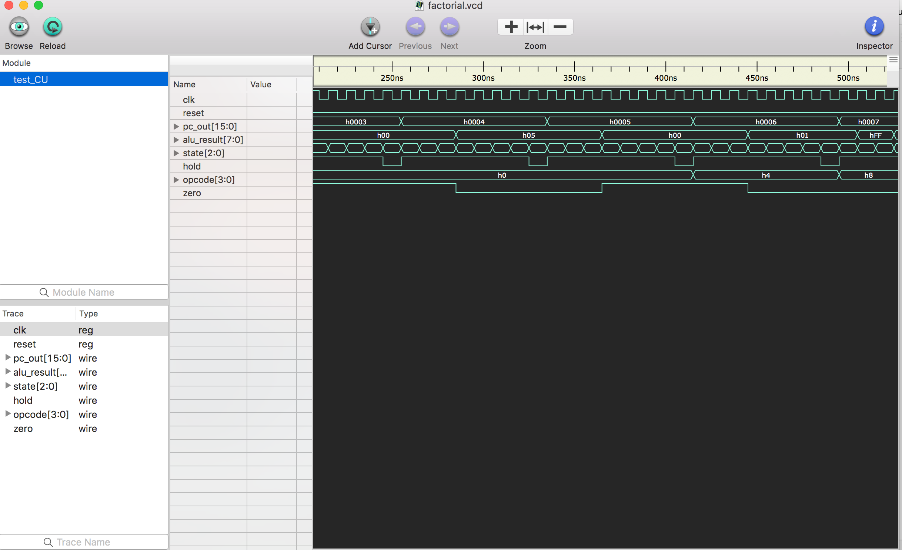

# 8 bit RISC Microprocessor

**Author: Varun Sundar, EE16B068.**

_Done as a part of semester project for EE2016 (Fall 2017)_

This serves as both a documentation and a report for the project.
Architecture based on Harvard RISC Architecture.

Block Diagram

_________
### General Structure:

* 8 bit processor.
* 8 bit Program counter.
* 16 bit IMEM output.
* 8 registers R0 to R7, of 8 bits each.
_________

### Module Descriptions:

1. #### Instruction memory
This is be a combinational unit - it takes just the address bus (8 bit value) as input, and gives out a 16-bit value that is the instruction to be decoded. The address is provided by the Program Counter (PC).

2. #### Program Counter
8 bit register. Under normal operations, will always increment by 1 on every clock cycle, to access the next instruction. In case of a JUMP or BRANCH type of instruction, will go to the value specified by the output of the ALU or the immediate operand in the instruction.

3. #### Register file
This is a set of 8 registers, each storing an 8 bit value. There are 2 output values ra and rb, whose values are selected based on the instruction word, as in the instruction definitions given above. There is one port by which data can be written into one of the registers, with an enable signal to control whether or not to update the value.

4. #### Data Memory
This is a sequential / clocked unit. At any given cycle, you are either reading from it or writing to it, with the address given by the address bus. In case of a lw (load-word) or sw (store-word) instruction, the address is either immediate or the output of the ALU.

5. #### Arithmetic and Logic Unit (ALU)
The core of the processor - all the actual computations are performed here. As shown in the instruction set, operations such as addition, subtraction and logical operations are all done in this unit. Also, the output of the ALU is used as the address for certain memory related operations.

6. #### Control unit
The unit that actually makes the entire processor work as expected. The input to this is the instruction word, and the output is a set of control signals that decide, for example, whether the register file is to updated, what operation is to be done by the ALU, whether memory read or write is required etc.

This has been implemented by generating the following control signals (not seen in the block diagram, for brevity):

* **MemToReg**: does data being written into the register file come from memory or from output of the ALU
* **MemWrite**: is the present operation going to write into memory?
* **RegWrite**: is an entry in the register file (pointed to by rd) supposed to get an updated value in this instruction?
* **ALUSrc**: is this an immediate operation, or a register operation?
* **Branch**: If the current instruction is a branch, then use this signal as select for a multiplexer to feed the PC.
* **Jump**: Control the PC input MUX and also the immediate operand for input to PC.
_________

### ALU Opcodes:

3'b000: {carry,result} = a + b; // add  
R0 is for carry.
3'b001: {borrow,result} = a - b; // sub  
3'b010: result = ~a;        // Invert  
3'b011: result = a<<b;     //Left shift by b bits  
3'b100: result = a>>b;     //Right shift by b bits  
3'b101: result = a & b; // and  
3'b110: result = a | b; // or  
3'b111: begin if (a<b) result = 16'd1; //compare if a<b  
default: add  

------------

### The Instruction set of the RISC processor:

_Note: Ra, Rb, Rd refer to register values. We have set all of them to zero initially._

#### A. Immediate Access Instructions (branch is written seperately below)
1. Load Word:  (OP 1011)  
               lw Rd Ra immem                 Rd_value<=Mem[Ra_value +immem ]

2. Store Word: (OP 1111)
               sw Rd Ra immem                 Mem[Ra_value + immem]<=Rd_value

3. Add Immediate: (OP 0100)  
    addi Rd Ra immem      Rd_value<=Ra_value+immem

4. Subtract Immediate: (OP 0101)  
    subi Rd Ra immem      Rd_value<=Ra_value-immem

#### B. Data Processing Instructions

1. Add:       (OP 0000, func 000)  
               add Rd Ra Rb   Rd<=Ra+Rb

2. Subtract:   (OP 0000, func 001)  
                sub Rd Ra Rb   Rd<=Ra-Rb

3. Invert (1‘s complement):    (OP 0000, func 010)  
               inv Rd Ra Rb   Rd<=~Ra

4. Logical Shift Left:        (OP 0000, func 011)  
               lsl Rd Ra Rb   Rd<=Ra<<Rb

5. Logical Shift Right:       (OP 0000, func 100)  
               lsr Rd Ra Rb   Rd<=Ra>>Rb

6. Bitwise AND:               (OP 0000, func 101)  
              and Rd Ra Rb   Rd<=Ra & Rb

7. Bitwise OR:                (OP 0000, func 110)  
              or Rd Ra Rb   Rd<=Ra || Rb

8. Set on Less Than:          (OP 0000, func 111)  
             cmp Rd Ra Rb   Rd=(Ra<Rb)?1:0

#### C. Control Flow Instructions
1. Branch on Equal:          (OP 1000)  
               beq rb, ra, immem
               Branch to immem when ra == rb

2. Branch on Not Equal:      (OP 1001)  
              bne rb, ra, immem
              Branch to immem when ra != rb

3. Jump: to j_line   (OP 0010)  
            j j_line;

4. Move: mov Ra Rb   (OP 0011)  
        Rb <= Ra  
        Ra<=0

5. End of Program: eop (OP 0111)  
        Holds pc.

--------

### The Instruction Skeleton of the RISC processor:

**Memory Access: Load**

  <4 Opcode>  <3 RS1> <3 WS>  <6 Offset>

**Memory Access: Store**

  <4 Opcode>  <3 RS1> <3 RS2>  <6 Offset>

**Data Processing:**

  <4 Opcode>  <3 RS1> <3 RS2>  <3 WS> <3 Neglect>

**Branch: (BNE and BEQ)**

  <4 Opcode>  <3 RS1> <3 Rs2>  <6 Offset>

**Jump:**

  <4 Opcode>  <12 Offset>

**MOV:**

<4 Opcode> <3 Ra> <3 Rb>

_________

### Processor Control Unit Design:

Changes in jump (to any line).

Inclusion of subi, bne, mov.

### Instruction Format:

_We have extended a few on the same lines._

_________

### Control Unit Output Signals:

1. jump: Control the PC input MUX and also the immediate operand for input to PC.  

2. beq: BNE signal , branch

3. bne: BEQ signal, branch

4. mem_read: Are you reading memory?

5. mem_write: Are you writing to memory?

6. alu_src: Is this an immediate operation, or a register operation?

7. reg_dst: Data processing in register.    

8. mem_to_reg: Does data being written into the register file come from memory or from output of the ALU  

9. reg_write: Is an entry in the register file (pointed to by rd) supposed to get an updated value in this instruction?  

This reflects in PFCL Design, and ALU control Design.

_________

### Sample output

* Program to find n factorial.
* Code present at ./test/factorial.txt
* Compiled code present at ./test/factorial_prog.txt
* Output logs at ./test/factorial.o
* Verilog vvp compilation at ./test/factorial
* Sample waveform:

_________

### Assembler Syntax

Run:

> python assembler.py source destination
_________

### Content of Text Files:

1. data.txt: contains register values. There are 8 such registers.
2. ./test/: this folder contains the output of simulations. Stored in format date_time.o
3. prog.txt: contains program to be executed. (Under relevant directories in test)

_________

### Implementation Notes:

1. Cannot use $fmonitor in icarus verilog, may use it in xilinx.
2. View waveforms in ./test/ or ./Waveform with gtkwave or scansion.
3. Run as :
  > iverilog -o destination ./test_CU_n.v  
  > vvp destination  
  > // Modify relevant parameters in Parameter.v first  
4. Change program count parameter to exceed beyond 16 instructions. Can support up to 256 lines of program code.
